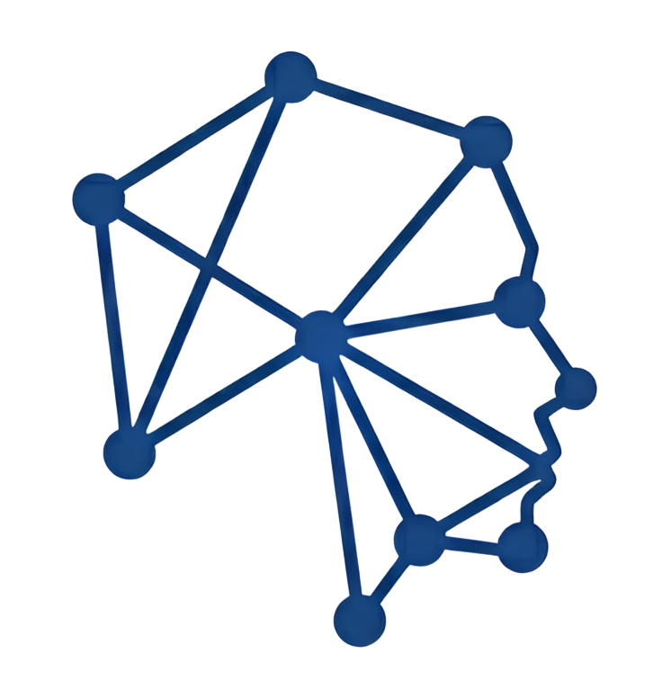

# Identificar también es dignidad



**Platanus Hack 26 · CDMX — Track ☎️ Legacy — team-18**

Plataforma que cruza reportes de **personas desaparecidas** (datos *ante mortem*)
contra registros de **cuerpos y restos no identificados** (datos *post mortem*)
en México, para encontrar coincidencias probables y ayudar a familias y
autoridades en la crisis de identificación forense.

Ante la fragmentación de la información oficial, el sistema funciona como un
**agregador**: recolecta datos de fuentes dispersas mediante scraping, los
normaliza a un esquema común y los compara con un **motor de score determinista
y auditable** que asigna un peso estadístico a cada variable (un tatuaje pesa
mucho más que el color de cabello).

---

## Cómo funciona

```
  Fuentes públicas                Normalización          Cruce               Web
 ┌──────────────────┐   scrape   ┌───────────────┐      ┌──────────┐      ┌─────────┐
 │ RNPDNO (AM)      │ ─────────► │  Supabase     │ ───► │ match.ts │ ───► │ Next.js │
 │ IJCF Jalisco (PM)│           │  persona      │      │ blocking │      │ Buscador│
 │ Sinaloa SEMEFO   │           │  forense      │      │ + score  │      └─────────┘
 │ Firecrawl (web)  │           │  lugares      │      └────┬─────┘
 └──────────────────┘           └───────────────┘           ▼
                                                      coincidencias
```

1. **Recolección** — varios scrapers extraen datos de fuentes oficiales y de la
   web abierta y los guardan en Supabase (Postgres).
2. **Normalización** — todo aterriza en un esquema común (`persona`, `forense`,
   `lugares`), con sexo, edad, estatura, fechas, geografía y `rasgos` (señas
   particulares / tatuajes).
3. **Cruce** — el motor de matching compara cada par persona↔forense y persiste
   las coincidencias con su puntaje y desglose campo por campo.
4. **Consulta** — la web permite buscar por nombre en el registro (coincidencias
   precalculadas) o ingresar datos manualmente (cálculo en vivo).

---

## El motor de matching

Vive en [`lib/matching/score.ts`](lib/matching/score.ts) — **lógica pura, sin
base de datos**, reutilizable desde el script de cruce, la API y la web. Trabaja
en dos etapas:

### 1) Blocking — descartar lo imposible
`pasaBlocking()` decide si un par es siquiera candidato, sin puntuar. Descarta
pares con sexos conocidos distintos, estados distintos, o cuando el hallazgo es
**anterior** a la desaparición. Ante datos faltantes, **deja pasar** (la
ausencia de información no descarta).

### 2) Score — promedio ponderado de lo comparable
`puntuar()` devuelve un score `0..1` y el desglose campo por campo. Es el
**promedio ponderado** de los campos que de verdad se pueden comparar; un campo
no comparable se **excluye** del cálculo (no cuenta como 0 ni como valor neutral).

| Campo      | Peso | Notas |
|------------|:----:|-------|
| tatuajes   | 3    | señal más fuerte; se compara por figura / zona corporal / lado |
| sexo       | 2    | solo si ambos son conocidos (no "Indeterminado") |
| edad       | 2    | dato puntual (AM) contra rango estimado (PM), con decaimiento |
| estatura   | 2    | decaimiento por diferencia en cm |
| fecha      | 1    | cercanía entre desaparición y hallazgo |
| lugar      | 1    | mismo estado / mismo municipio |

**Tatuajes y señas:** en lugar de aplanar el texto libre en una bolsa de
palabras, se separa en tres dimensiones independientes — **figura** (qué dibujo:
águila, rosa, un nombre), **zona** corporal canónica (antebrazo ≈ brazo) y
**lado** (izquierdo/derecho). La figura manda; zona y lado matizan. Un desacuerdo
de tatuajes es evidencia *débil*, no motivo de descarte (tiene un piso de
similitud).

> **¿Por qué no un LLM en el cruce?** El blocking evalúa muchísimos pares y exige
> un score auditable, determinista y reproducible. El lugar correcto para NLP/IA
> es *antes*: una sola vez por registro, normalizando el texto libre a
> `{tipo, zona, lado}` estructurado que el motor luego compara.

---

## Stack

- **Next.js 16** (App Router) + **React 19** — front y API route.
- **Supabase** (PostgreSQL) — almacenamiento, con Row Level Security (lectura
  pública, escritura solo autenticada).
- **GSAP** — animaciones del buscador.
- **TypeScript** + **tsx** — scripts de scraping y cruce.
- **cheerio** + **Firecrawl** — scraping de HTML y de la web abierta.

---

## Estructura

```
app/
  page.tsx                 Home → componente Buscador
  _components/Buscador.tsx  UI de búsqueda (autocompletado + resultados)
  api/buscar/route.ts       POST /api/buscar → cálculo en vivo contra forenses
lib/
  matching/score.ts         Motor de coincidencias (blocking + score, puro)
  supabase/                 Clientes: browser, server (SSR) y admin (service role)
  rnpdno/, firecrawl/       Clientes de las fuentes de datos
  types/                    Tipos de DB y modelos (persona / forense / lugar)
scripts/
  scrape-rnpdno.ts          Personas desaparecidas (RNPDNO) → persona
  scrape-jalisco.ts         Forense IJCF Jalisco (PFSI) → forense
  scrape-sinaloa.ts         Forense SEMEFO Sinaloa → forense
  scrape-firecrawl.ts       Búsqueda de personas en la web → persona
  match.ts                  Cruce AM↔PM → coincidencias
  match.test.ts             Tests del motor
doc/
  PROJECT.md, schema.sql    Descripción y esquema de la base
supabase/migrations/        Migraciones SQL
```

---

## Puesta en marcha

### 1. Requisitos
- Node.js y **pnpm**.
- Un proyecto de **Supabase** (con el esquema de [`doc/schema.sql`](doc/schema.sql)
  aplicado vía las migraciones de `supabase/migrations/`).

### 2. Variables de entorno
Copia `.env.example` a `.env.local` y rellena los valores (Supabase →
*Project Settings → API*):

```bash
NEXT_PUBLIC_SUPABASE_URL=
NEXT_PUBLIC_SUPABASE_ANON_KEY=
SUPABASE_SERVICE_ROLE_KEY=   # secreta — solo para scripts de servidor, nunca al navegador
FIRECRAWL_API_KEY=           # solo para scrape:firecrawl
```

### 3. Instalar y correr la web
```bash
pnpm install
pnpm dev          # http://localhost:3000
```

---

## Scripts

| Comando | Qué hace |
|---------|----------|
| `pnpm dev` / `pnpm build` / `pnpm start` | Desarrollo / build / producción de Next.js |
| `pnpm lint` | Linter |
| `pnpm scrape:rnpdno [estado] [pág]` | Personas desaparecidas del RNPDNO → `persona` |
| `pnpm scrape:jalisco [desde] [hasta]` | Forense IJCF Jalisco (PFSI) → `forense` |
| `pnpm scrape:sinaloa [añoIni] [añoFin]` | Forense SEMEFO Sinaloa → `forense` |
| `pnpm scrape:firecrawl ["consulta"\|estados]` | Personas desde la web abierta → `persona` |
| `pnpm match [umbral]` | Cruza AM↔PM y guarda en `coincidencias` (idempotente) |

Flujo típico: poblar `persona` y `forense` con los scrapers → `pnpm match` para
calcular coincidencias → consultar desde la web.

---

## Modelo de datos

- **`persona`** — reporte *ante mortem*: nombre, edad, estatura, sexo, fecha de
  desaparición, último lugar, `rasgos`.
- **`forense`** — registro *post mortem*: rango de edad, estatura, sexo, fecha de
  hallazgo, lugar, `rasgos`.
- **`lugares`** — estado / municipio referenciados por ambas tablas.
- **`coincidencias`** — par (forense, persona) con `score 0..1`, `puntaje 0..100`,
  `desglose` (JSONB campo por campo) y `razon`. Único por par (upsert → re-correr
  el cruce actualiza, no duplica).

---

## Privacidad y alcance

Se manejan **datos personales de víctimas** provenientes de fuentes públicas, con
fines exclusivamente **humanitarios**. Las coincidencias son **orientativas**:
toda identificación debe confirmarse por la autoridad competente. La búsqueda
manual en la web es anónima y no se almacena.

---

## Equipo (team-18)

- Lilith Jaquelin Díaz Reyes ([@pinktaty](https://github.com/pinktaty))
- Kristian Leonel Benítez Pérez ([@fk2731](https://github.com/fk2731))
- Edson André Cortés Silva ([@eds04ndre](https://github.com/eds04ndre))
- Yael Rodriguez Escobar ([@overcome7484](https://github.com/overcome7484))
- Maryam Michelle Del Monte Ortega ([@maryamoww1](https://github.com/maryamoww1))
